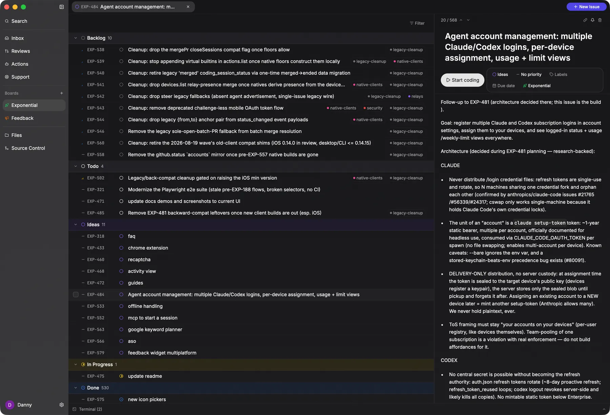
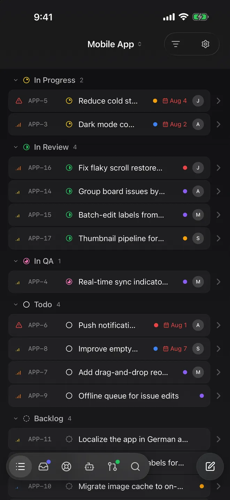

# Exponential

[](./LICENSE)

**Vibecode together.** Issues, customer support, and coding agents in one realtime tracker. Agents run on your own machines, on your own subscription. Web, macOS, Linux, Windows, iOS, Android.

<p align="center">
  
</p>
<p align="center">
  
</p>

- **Cloud**: [app.exponential.at](https://app.exponential.at/?ref=github), free for up to three people
- **Self-host**: one `docker compose`, no seat caps, no licence gate
- **Desktop app**: [exponential.at/download](https://exponential.at/download/?ref=github)

## What you get

- **Issues** with statuses, priorities, labels, due dates, markdown, @mentions. Realtime sync on every client via [ElectricSQL](https://electric-sql.com).
- **Boards backed by a GitHub repo**: one issue, one branch, one PR, tracked on the issue. Or one combined PR for a batch.
- **Start coding**: hand an issue to Claude Code, Codex, or pi from the desktop app. It plans, codes in a worktree, and opens the PR.
- **Live steer**: watch and redirect a running session from your phone.
- **Feedback widget**: a script tag for your site, bug reports with annotated screenshots land as issues.
- **MCP server** at `/api/mcp` for Claude Code, Codex, Cursor, or any MCP client.

## Self-host

```sh
mkdir exponential && cd exponential
curl -fsSLO https://raw.githubusercontent.com/Niach/exponential/master/selfhost/docker-compose.yaml
curl -fsSL https://raw.githubusercontent.com/Niach/exponential/master/selfhost/.env.example -o .env
# fill in .env: two secrets + S3 credentials
docker compose up -d
```

App at `http://localhost`. Migrations run on boot. A GitHub App is only needed for the coding features. Full runbook: [`INSTALL.md`](./INSTALL.md), env reference: [`.env.example`](./.env.example). Upgrade with `docker compose pull && docker compose up -d`.

The only cloud-only feature is mobile push (store apps are built against the first-party Firebase project).

## Connect an MCP client

```sh
claude mcp add --transport http exponential https://app.exponential.at/api/mcp
```

## Development

Needs [bun](https://bun.sh), Node ≥ 20.19, and Docker Compose.

```sh
bun install
cp .env.example .env
cp Caddyfile.example Caddyfile
bun run backend        # docker compose up -d + web dev server (localhost:3000)
bun run storage:init   # one-time S3 bootstrap, prints keys for .env
```

```
apps/web        TanStack Start app: tracker, API, Electric shape proxies
apps/desktop    Rust IDE (gpui)
apps/ios        SwiftUI
apps/android    Kotlin / Compose
apps/marketing  exponential.at
packages/       db schema, widget, icons, contracts
```

Other scripts: `bun run ios`, `bun run android`, `bun run dev:desktop`, `bun run typecheck`, `bun run test`. Don't run `bun run lint` (its `--fix` breaks `typeof import()` sites). Architecture notes live in [`CLAUDE.md`](./CLAUDE.md).

## License

[Apache-2.0](./LICENSE). [Enterprise Support](https://exponential.at/contact/?ref=github) is available for self-hosters who want an SLA or deployment help.
